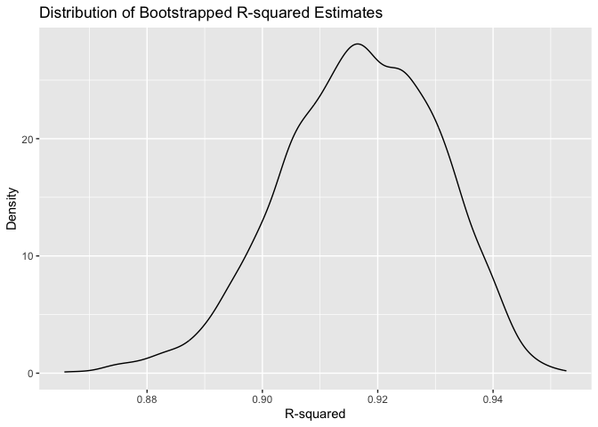
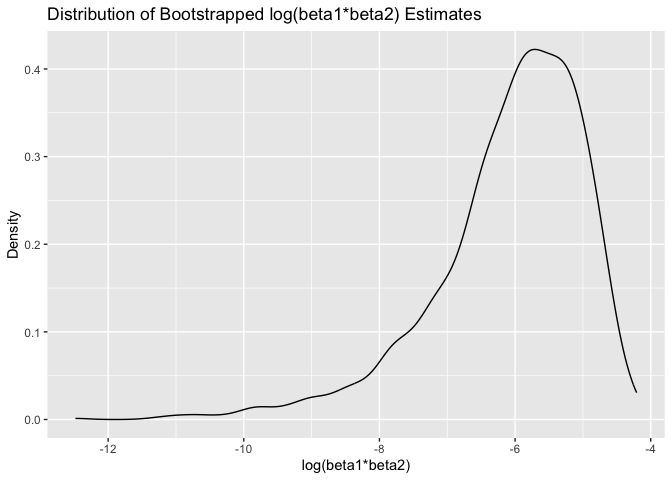
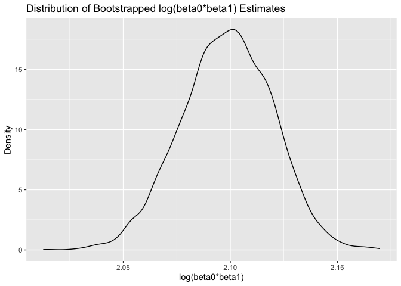

p8105_hw6_zw2974
================
Zihan Wu
2023-11-18

## Problem 2

#### Download data

``` r
weather_df = 
  rnoaa::meteo_pull_monitors(
    c("USW00094728"),
    var = c("PRCP", "TMIN", "TMAX"), 
    date_min = "2022-01-01",
    date_max = "2022-12-31") |>
  mutate(
    name = recode(id, USW00094728 = "CentralPark_NY"),
    tmin = tmin / 10,
    tmax = tmax / 10) |>
  select(name, id, everything())
```

    ## using cached file: /Users/zihanwu/Library/Caches/org.R-project.R/R/rnoaa/noaa_ghcnd/USW00094728.dly

    ## date created (size, mb): 2023-09-28 10:20:44.257071 (8.524)

    ## file min/max dates: 1869-01-01 / 2023-09-30

#### Bootstrap Analysis

``` r
boot_sample = function(weather_df) {
  sample_n(weather_df, size = nrow(weather_df), replace = TRUE)
}
```

#### 5000 bootstrap samples

``` r
boot_strap = weather_df |>  
  modelr::bootstrap(n = 5000) |> 
  mutate(
    mods = map(strap, ~lm(tmax ~ tmin + prcp, data = .x)),
    mods_beta = map(mods, broom::glance),
    mods_r2 = map(mods, broom::tidy)) |> 
  unnest(mods_r2, mods_beta) |> 
  dplyr::select(.id, term, estimate, r.squared) |> 
  pivot_wider(names_from = term, values_from = estimate) |> 
  rename(
    beta_0 = `(Intercept)`,
    beta_1 = tmin,
    beta_2 = prcp) 
```

    ## Warning: `unnest()` has a new interface. See `?unnest` for details.
    ## ℹ Try `df %>% unnest(c(mods_r2, mods_beta))`, with `mutate()` if needed.

``` r
res = boot_strap |> 
  summarise(r.squared = r.squared,
    log_beta12 = log(beta_1 * beta_2),
    log_beta01 = log(beta_0 * beta_1))
```

    ## Warning: There was 1 warning in `summarise()`.
    ## ℹ In argument: `log_beta12 = log(beta_1 * beta_2)`.
    ## Caused by warning in `log()`:
    ## ! NaNs produced

    ## Warning: Returning more (or less) than 1 row per `summarise()` group was deprecated in
    ## dplyr 1.1.0.
    ## ℹ Please use `reframe()` instead.
    ## ℹ When switching from `summarise()` to `reframe()`, remember that `reframe()`
    ##   always returns an ungrouped data frame and adjust accordingly.
    ## Call `lifecycle::last_lifecycle_warnings()` to see where this warning was
    ## generated.

#### CI for r-squared and log

``` r
# calculate CI for r-squared and log
r2_ci = 
  quantile(pull(res,r.squared), probs = c(0.025,0.975)) |> 
  knitr::kable()

log_ci = 
  quantile(pull(res,log_beta01), probs = c(0.025,0.975)) |>  
  knitr::kable()
  
r2_ci
```

|       |         x |
|:------|----------:|
| 2.5%  | 0.8885495 |
| 97.5% | 0.9406812 |

``` r
log_ci
```

|       |        x |
|:------|---------:|
| 2.5%  | 2.055008 |
| 97.5% | 2.138300 |

#### Distribution Plots

``` r
r2_dist = res |> 
  ggplot(aes(x = r.squared)) +
  geom_density() +
  labs(title = "Distribution of Bootstrapped R-squared Estimates", x = "R-squared", y = "Density")
r2_dist
```

<!-- -->

This plot is a density plot of bootstrapped R-squared estimates. The
distribution of the R-squared values is unimodal and shows a peak around
0.92, indicating that the majority of the bootstrapped samples have an
R-squared value close to this number. Also, the distribution is slightly
skewed to the left, but is approximately as normal distribution.

``` r
b1b2_dist = res |> 
  ggplot(aes(x = log_beta12)) +
  geom_density() +
  labs(title = "Distribution of Bootstrapped log(beta1*beta2) Estimates", x = "log(beta1*beta2)", y = "Density")
b1b2_dist
```

    ## Warning: Removed 3361 rows containing non-finite values (`stat_density()`).

<!-- -->

This plot is a density plot of bootstrapped Log Beta Product estimates.
The distribution appears to be left-skewed, which may be caused by the
`NA` generated during the logarithm calculation.

``` r
b0b1_dist = res |> 
  ggplot(aes(x = log_beta01)) +
  geom_density() +
  labs(title = "Distribution of Bootstrapped log(beta0*beta1) Estimates", x = "log(beta0*beta1)", y = "Density")
b0b1_dist
```

<!-- -->

This plot is also a density plot of bootstrapped Log Beta Product
estimates. It follows the normal distribution.
