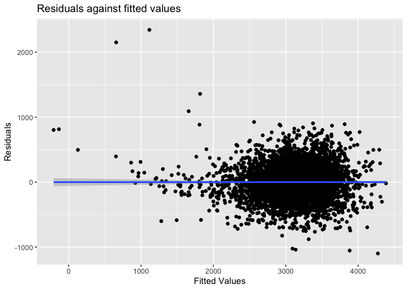
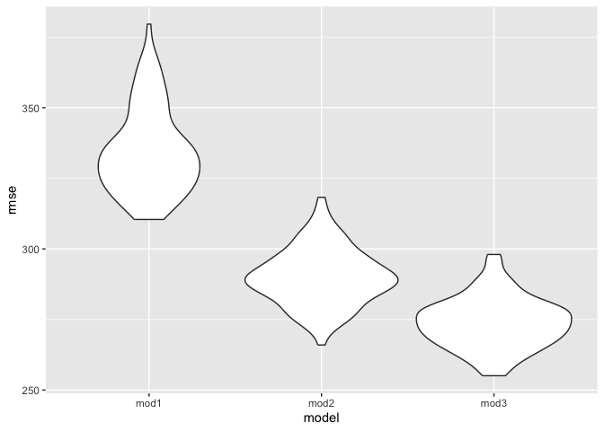

p8105_hw6_zw2974
================
Zihan Wu
2023-11-18

## Problem 2

#### Download data

``` r
weather_df = 
  rnoaa::meteo_pull_monitors(
    c("USW00094728"),
    var = c("PRCP", "TMIN", "TMAX"), 
    date_min = "2022-01-01",
    date_max = "2022-12-31") |>
  mutate(
    name = recode(id, USW00094728 = "CentralPark_NY"),
    tmin = tmin / 10,
    tmax = tmax / 10) |>
  select(name, id, everything())
```

    ## using cached file: /Users/zihanwu/Library/Caches/org.R-project.R/R/rnoaa/noaa_ghcnd/USW00094728.dly

    ## date created (size, mb): 2023-09-28 10:20:44.257071 (8.524)

    ## file min/max dates: 1869-01-01 / 2023-09-30

#### Bootstrap Analysis

``` r
boot_sample = function(weather_df) {
  sample_n(weather_df, size = nrow(weather_df), replace = TRUE)
}
```

#### 5000 bootstrap samples

``` r
boot_strap = weather_df |>  
  modelr::bootstrap(n = 5000) |> 
  mutate(
    mods = map(strap, ~lm(tmax ~ tmin + prcp, data = .x)),
    mods_beta = map(mods, broom::glance),
    mods_r2 = map(mods, broom::tidy)) |> 
  unnest(mods_r2, mods_beta) |> 
  dplyr::select(.id, term, estimate, r.squared) |> 
  pivot_wider(names_from = term, values_from = estimate) |> 
  rename(
    beta_0 = `(Intercept)`,
    beta_1 = tmin,
    beta_2 = prcp) 
```

    ## Warning: `unnest()` has a new interface. See `?unnest` for details.
    ## ℹ Try `df %>% unnest(c(mods_r2, mods_beta))`, with `mutate()` if needed.

``` r
res = boot_strap |> 
  summarise(r.squared = r.squared,
    log_beta12 = log(beta_1 * beta_2),
    log_beta01 = log(beta_0 * beta_1))
```

    ## Warning: There was 1 warning in `summarise()`.
    ## ℹ In argument: `log_beta12 = log(beta_1 * beta_2)`.
    ## Caused by warning in `log()`:
    ## ! NaNs produced

    ## Warning: Returning more (or less) than 1 row per `summarise()` group was deprecated in
    ## dplyr 1.1.0.
    ## ℹ Please use `reframe()` instead.
    ## ℹ When switching from `summarise()` to `reframe()`, remember that `reframe()`
    ##   always returns an ungrouped data frame and adjust accordingly.
    ## Call `lifecycle::last_lifecycle_warnings()` to see where this warning was
    ## generated.

#### CI for r-squared and log

``` r
# calculate CI for r-squared and log
r2_ci = 
  quantile(pull(res,r.squared), probs = c(0.025,0.975)) |> 
  knitr::kable()

log_ci = 
  quantile(pull(res,log_beta01), probs = c(0.025,0.975)) |>  
  knitr::kable()
  
r2_ci
```

|       |         x |
|:------|----------:|
| 2.5%  | 0.8885495 |
| 97.5% | 0.9406812 |

``` r
log_ci
```

|       |        x |
|:------|---------:|
| 2.5%  | 2.055008 |
| 97.5% | 2.138300 |

#### Distribution Plots

``` r
r2_dist = res |> 
  ggplot(aes(x = r.squared)) +
  geom_density() +
  labs(title = "Distribution of Bootstrapped R-squared Estimates", x = "R-squared", y = "Density")
r2_dist
```

<!-- -->

This plot is a density plot of bootstrapped R-squared estimates. The
distribution of the R-squared values is unimodal and shows a peak around
0.92, indicating that the majority of the bootstrapped samples have an
R-squared value close to this number. Also, the distribution is slightly
skewed to the left, but is approximately as normal distribution.

``` r
b1b2_dist = res |> 
  ggplot(aes(x = log_beta12)) +
  geom_density() +
  labs(title = "Distribution of Bootstrapped log(beta1*beta2) Estimates", x = "log(beta1*beta2)", y = "Density")
b1b2_dist
```

    ## Warning: Removed 3361 rows containing non-finite values (`stat_density()`).

<!-- -->

This plot is a density plot of bootstrapped Log Beta Product estimates.
The distribution appears to be left-skewed, which may be caused by the
`NA` generated during the logarithm calculation.

``` r
b0b1_dist = res |> 
  ggplot(aes(x = log_beta01)) +
  geom_density() +
  labs(title = "Distribution of Bootstrapped log(beta0*beta1) Estimates", x = "log(beta0*beta1)", y = "Density")
b0b1_dist
```

<!-- -->

This plot is also a density plot of bootstrapped Log Beta Product
estimates. It follows the normal distribution.

## Problem 2

#### Import and Tidy Data

``` r
birthweight = read_csv("data/birthweight.csv")
```

    ## Rows: 4342 Columns: 20
    ## ── Column specification ────────────────────────────────────────────────────────
    ## Delimiter: ","
    ## dbl (20): babysex, bhead, blength, bwt, delwt, fincome, frace, gaweeks, malf...
    ## 
    ## ℹ Use `spec()` to retrieve the full column specification for this data.
    ## ℹ Specify the column types or set `show_col_types = FALSE` to quiet this message.

``` r
birth = 
  birthweight |> 
  janitor::clean_names() |> 
  mutate(babysex = case_when(babysex == 1 ~ 'male',
                             babysex == 2 ~ 'female'),
         frace = recode(frace, "1" = "White", "2" = "Black", "3" = "Asian", "4" = "Puerto Rican", "8" = "Other", "9" = "Unknown"),
         malform = case_when(malform == 0 ~ 'absent',
                             malform == 1 ~ 'present'),
         mrace = recode(mrace, "1" = "White", "2" = "Black", "3" = "Asian", "4" = "Puerto Rican", "8" = "Other")) |> 
  na.omit()
```

## Regression Model

Assume all variables as predictors and perform MLR

``` r
mlr = lm(bwt ~ ., data = birth)
mlr |> 
  broom::tidy() |> 
  knitr::kable()
```

| term              |      estimate |   std.error |  statistic |   p.value |
|:------------------|--------------:|------------:|-----------:|----------:|
| (Intercept)       | -6306.8345949 | 659.2639908 | -9.5664782 | 0.0000000 |
| babysexmale       |   -28.7073088 |   8.4652447 | -3.3911966 | 0.0007021 |
| bhead             |   130.7781455 |   3.4523248 | 37.8811826 | 0.0000000 |
| blength           |    74.9535780 |   2.0216656 | 37.0751613 | 0.0000000 |
| delwt             |     4.1007326 |   0.3948202 | 10.3863301 | 0.0000000 |
| fincome           |     0.2898207 |   0.1795416 |  1.6142265 | 0.1065513 |
| fraceBlack        |    -6.9048265 |  78.8349060 | -0.0875859 | 0.9302099 |
| fraceOther        |   -16.9391876 |  97.5931709 | -0.1735694 | 0.8622120 |
| fracePuerto Rican |   -68.2323428 |  78.4692463 | -0.8695425 | 0.3845988 |
| fraceWhite        |   -21.2361118 |  69.2959907 | -0.3064551 | 0.7592729 |
| gaweeks           |    11.5493872 |   1.4653680 |  7.8815609 | 0.0000000 |
| malformpresent    |     9.7649680 |  70.6258929 |  0.1382633 | 0.8900388 |
| menarche          |    -3.5507723 |   2.8950777 | -1.2264860 | 0.2200827 |
| mheight           |     9.7874130 |  10.3115672 |  0.9491683 | 0.3425881 |
| momage            |     0.7593479 |   1.2221417 |  0.6213256 | 0.5344182 |
| mraceBlack        |   -60.0487959 |  80.9532075 | -0.7417717 | 0.4582660 |
| mracePuerto Rican |    34.9078811 |  80.9480792 |  0.4312379 | 0.6663169 |
| mraceWhite        |    91.3866079 |  71.9189677 |  1.2706885 | 0.2039079 |
| parity            |    95.5411137 |  40.4792711 |  2.3602479 | 0.0183069 |
| pnumlbw           |            NA |          NA |         NA |        NA |
| pnumsga           |            NA |          NA |         NA |        NA |
| ppbmi             |     4.3537865 |  14.8913292 |  0.2923706 | 0.7700173 |
| ppwt              |    -3.4715550 |   2.6121254 | -1.3290155 | 0.1839131 |
| smoken            |    -4.8543629 |   0.5870549 | -8.2690107 | 0.0000000 |
| wtgain            |            NA |          NA |         NA |        NA |

#### Plot the model residuals against fitted values

``` r
birth |> 
    add_predictions(mlr) |>  
    add_residuals(mlr) |> 
    ggplot(aes(x = pred, y = resid)) +
    geom_point()  + 
    geom_smooth(method = "lm") + 
    labs(title = "Residuals against fitted values", 
       x = "Fitted Values", 
       y = "Residuals")
```

    ## Warning in predict.lm(model, data): prediction from rank-deficient fit; attr(*,
    ## "non-estim") has doubtful cases

    ## Warning in predict.lm(model, data): prediction from rank-deficient fit; attr(*,
    ## "non-estim") has doubtful cases

    ## `geom_smooth()` using formula = 'y ~ x'

<!-- --> We
can find from the graph that the slope is 0, which means we have to
choose predictors to measure the relationship.

#### Compare model to others

A model that employs only the baby’s length at birth and gestational age
as its main predictors, without considering any interaction effects
between these variables.

A model that includes the baby’s head circumference, length at birth,
and sex as predictors, and additionally incorporates all possible
interaction effects, including two-way interactions between each pair of
these variables as well as the three-way interaction among head
circumference, length, and sex.

``` r
# model comparison 1
model_bg = lm(bwt ~ blength + gaweeks, data = birth) |> 
  broom::tidy() |> 
  knitr::kable()

# model comparison 2
model_bbb = lm(bwt ~ bhead * blength * babysex, data = birth) |> 
  broom::tidy() |> 
  knitr::kable()
model_bg
```

| term        |    estimate | std.error | statistic | p.value |
|:------------|------------:|----------:|----------:|--------:|
| (Intercept) | -4347.66707 | 97.958360 | -44.38281 |       0 |
| blength     |   128.55569 |  1.989891 |  64.60439 |       0 |
| gaweeks     |    27.04673 |  1.717930 |  15.74379 |       0 |

#### Compare these models by evaluating their cross-validated prediction errors. Utilize the `crossv_mc` function for cross-validation and apply relevant functions from the `purrr` package as needed for this analysis.

``` r
cv_df = 
  crossv_mc(birth, 100) |> 
  mutate(
    mod1 = map(train, \(train) lm(bwt ~ blength + gaweeks, data = train) ),
    mod2 = map(train, \(train) lm(bwt ~ bhead * blength * babysex, data = train)),
    mod3 = map(train, \(train) lm(bwt ~ ., data = train))
  ) |> 
  mutate(
    rmse_mod1 = map2_dbl(mod1, test, \(mod, test) rmse(model = mod, data = test)),
    rmse_mod2 = map2_dbl(mod2, test, \(mod, test) rmse(model = mod, data = test)),
    rmse_mod3 = map2_dbl(mod3, test, \(mod, test) rmse(model = mod, data = test))
  )
```

    ## Warning: There were 100 warnings in `mutate()`.
    ## The first warning was:
    ## ℹ In argument: `rmse_mod3 = map2_dbl(mod3, test, function(mod, test) rmse(model
    ##   = mod, data = test))`.
    ## Caused by warning in `predict.lm()`:
    ## ! prediction from rank-deficient fit; attr(*, "non-estim") has doubtful cases
    ## ℹ Run `dplyr::last_dplyr_warnings()` to see the 99 remaining warnings.

``` r
cv_df
```

    ## # A tibble: 100 × 9
    ##    train                   test                  .id   mod1   mod2   mod3  
    ##    <list>                  <list>                <chr> <list> <list> <list>
    ##  1 <resample [3,473 x 20]> <resample [869 x 20]> 001   <lm>   <lm>   <lm>  
    ##  2 <resample [3,473 x 20]> <resample [869 x 20]> 002   <lm>   <lm>   <lm>  
    ##  3 <resample [3,473 x 20]> <resample [869 x 20]> 003   <lm>   <lm>   <lm>  
    ##  4 <resample [3,473 x 20]> <resample [869 x 20]> 004   <lm>   <lm>   <lm>  
    ##  5 <resample [3,473 x 20]> <resample [869 x 20]> 005   <lm>   <lm>   <lm>  
    ##  6 <resample [3,473 x 20]> <resample [869 x 20]> 006   <lm>   <lm>   <lm>  
    ##  7 <resample [3,473 x 20]> <resample [869 x 20]> 007   <lm>   <lm>   <lm>  
    ##  8 <resample [3,473 x 20]> <resample [869 x 20]> 008   <lm>   <lm>   <lm>  
    ##  9 <resample [3,473 x 20]> <resample [869 x 20]> 009   <lm>   <lm>   <lm>  
    ## 10 <resample [3,473 x 20]> <resample [869 x 20]> 010   <lm>   <lm>   <lm>  
    ## # ℹ 90 more rows
    ## # ℹ 3 more variables: rmse_mod1 <dbl>, rmse_mod2 <dbl>, rmse_mod3 <dbl>

``` r
cv_df |> 
  select(starts_with("rmse")) |> 
  pivot_longer(
    everything(),
    names_to = "model", 
    values_to = "rmse",
    names_prefix = "rmse_") |> 
  mutate(model = fct_inorder(model)) |> 
  ggplot(aes(x = model, y = rmse)) + geom_violin()
```

<!-- -->

Based on the analysis, it can be inferred that model3, which
incorporates all predictors, exhibits the most favorable distribution of
Root Mean Square Error (RMSE), showcasing the smallest RMSE values.
Conversely, model1, which only uses birth length and gestational age as
predictors, demonstrates the least favorable distribution, indicated by
the largest RMSE values.
